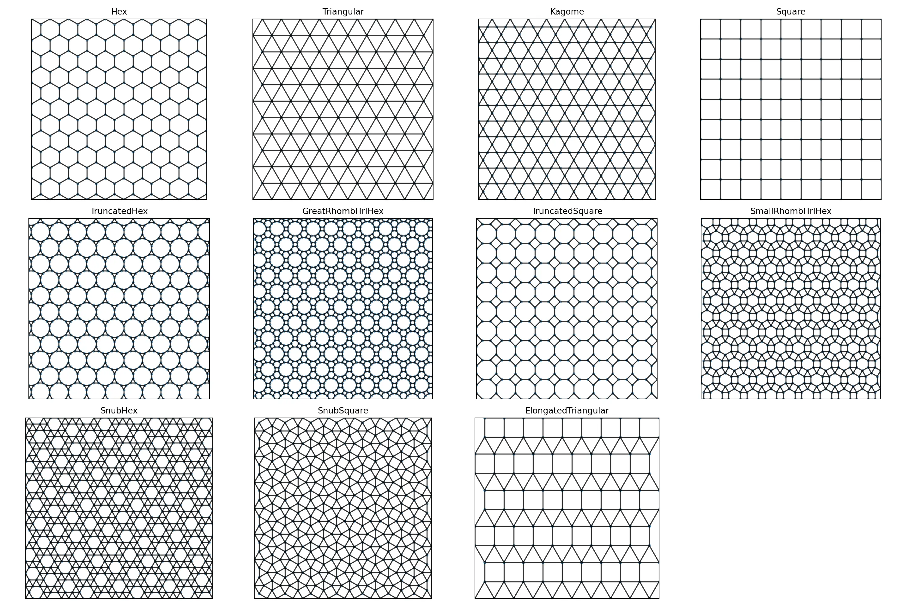

<div align="center">

<h3 align="center">architile : Create lattices with all 11 regular or uniform tilings</h3>

A small python library to generate 2D lattices based on repeating any of the 11 regular or uniform tilings.
Uniform tilings are arrangements of regular polygons that cover a plane without
gaps or overlaps, where each vertex has the same arrangement of polygons.

</div>

## All 11 regular or uniform tilings



## Getting started

```py
from architile import tiling, tile_into_rectangle

# Create a SnubSquare tiling
tile = tiling.SnubSquare(a=1.0)

# Tile it into a rectangle of width 5 and height 3
nodes, edges = tile_into_rectangle(5.0, 3.0, tile)

# tile it into a rectangle but put the pattern at an angle of 15 degrees
nodes, edges = tile_into_rectangle(5.0, 3.0, tile, theta=np.pi/12)
```

## Disclaimer

This is a research project, and the code is provided "as is" without warranty of any kind. Use at your own risk.
